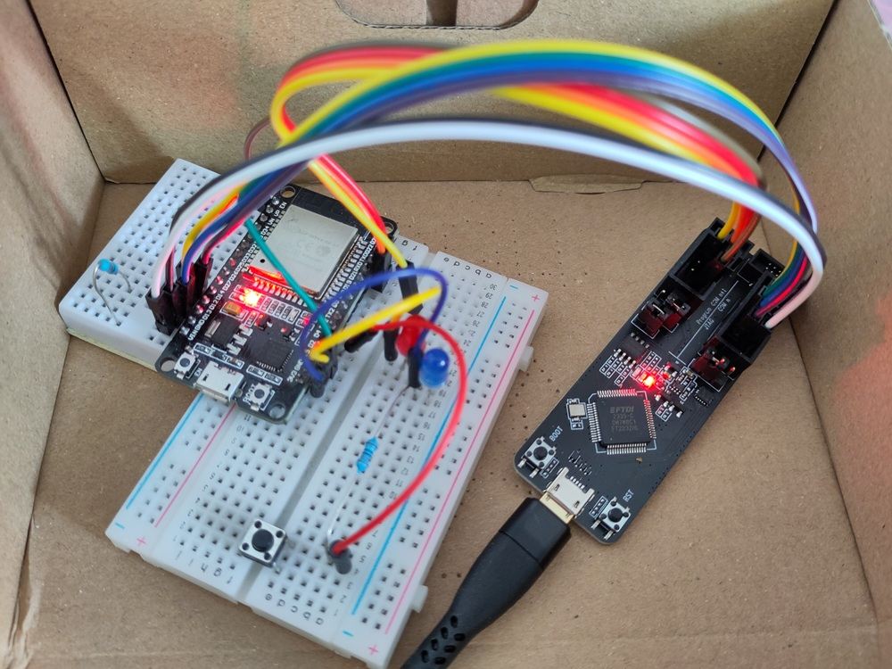

# ESP + Rust + VS-Code + Hardware Debugging

## Hardware

* Devkit v1 with ESP-WROOM-32
* ESP-PROG for JTAG
* ⚠️ some boards (i.e. ESP32-C3, ESP32-S3) have JTAG-to-USB on board, thus no external JTAG interface is needed

## Software

* cargo
* probe-rs
* vscode

## Challenges and Solutions

### Build and Flash with Subdirectories

In this repo there are two directories with code. The default build task for rust checks the root directory and fails. With specified `cwd` for the build task building (and flashing and debugging) works. (see `.vscode/tasks.json`)

## References

* my starting point to investigate debugging
  https://jesdev.io/esp32-debugging-guide/
* probe-rs -- the tool for debugging
  It has a vs-code extension I use for debugging
  https://probe.rs/docs/tools/debugger/
* Official Documentation for ESP-Prog
  Has pin layouts needed to attach the debug board to dev board (JTAG and Serial)
  https://docs.espressif.com/projects/esp-iot-solution/en/latest/hw-reference/ESP-Prog_guide.html
